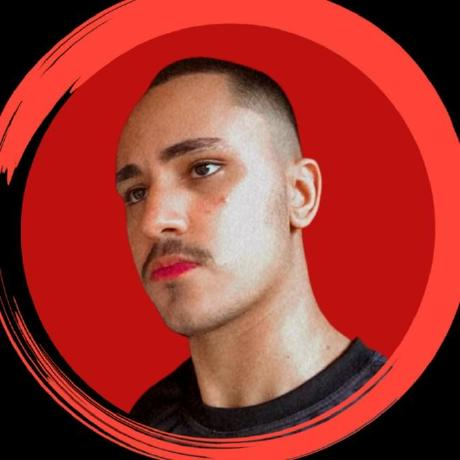

# SimuladorAFD

Projeto iniciado e concluído em 2024, preparado em menos de 1 semana. Requisitado pela disciplina de TELEFAC (Teoria das Linguagens Formais e Autômatos).

## Visão Geral
O projeto não é nada mais do que a construção de um simulador de AFD (Autômato Finito Determinístico), dentre o qual deverá ser rapaz de receber entradas para a construção de um AFD além de receber entradas para testes, retornando "Aceito" em caso de ser uma palavra possível de ser gerada e "Rejeitado" em caso de ser uma palavra não aceita.

## Tecnologias Utilizadas

A tecnologia usada para desenvolver o projeto é a seguinte:

 

## Contato
<strong> Membros Desenvolvedores do Projeto: </strong> Somos ambos estudantes de Ciência da Computação na Universidade Federal de Mato Grosso - Turma de 2022.

| Membro | Foto | Email | LinkedIn |
| --- | --- | --- | --- |
| Anthony Ricardo Rodrigues Rezende |  | anthony_rodriguespereira@outlook.com | [LinkedIn do Anthony](https://www.linkedin.com/in/anthony-ricardo-rodrigues-rezende-486917227/) |
| Alan Bruno Moraes Costa |  | alanbrunomoraescosta18@hotmail.com | [LinkedIn do Alan](https://www.linkedin.com/in/alan-morais-4861322b0) |
| Vinicius Padilha Vieira |  | vinicius_padilhavieira@outlook.com | [LinkedIn do Vinicius](https://www.linkedin.com/in/vinicius-padilha-vieira-486917227/) |
| Andrey Luiggi da Cruz |  | andrey_luiggidacruz@outlook.com | [LinkedIn do Andrey](https://www.linkedin.com/in/andrey-luiggi-da-cruz-4861322b0) |

##
